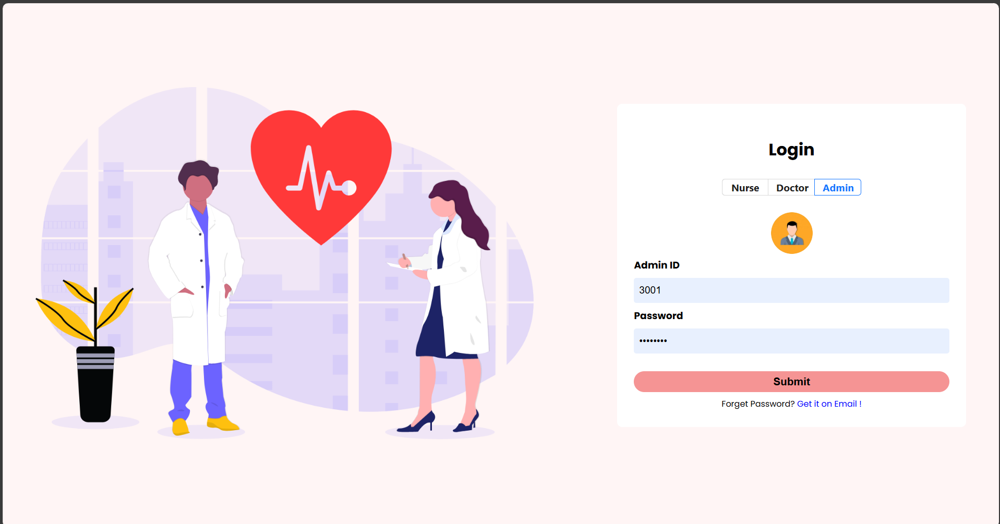
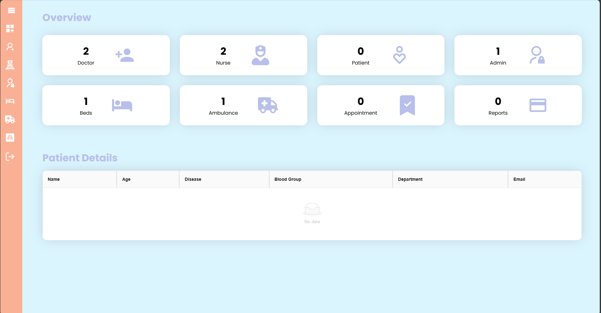
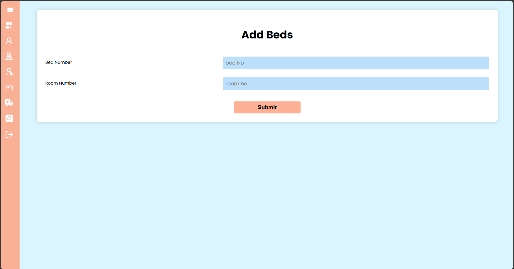
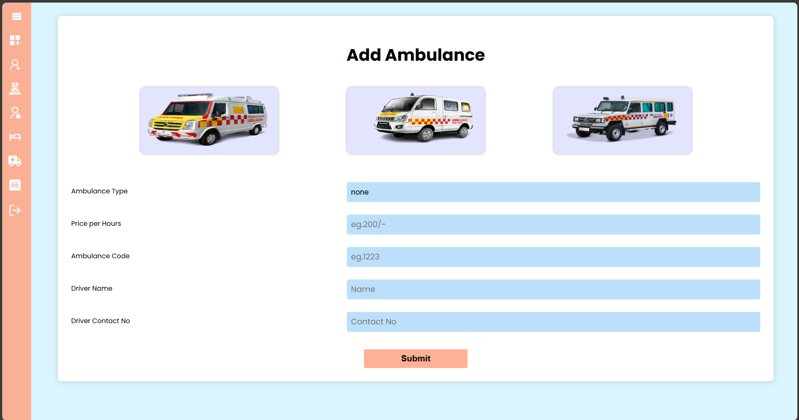

# 🏥 Hospital Management System

A comprehensive web-based Hospital Management System built with React.js frontend and Node.js backend with SQLite database. This system provides complete management solutions for hospitals, including patient management, doctor and nurse portals, appointment scheduling, bed management, and administrative functions.

## 📋 Table of Contents

- [Features](#-features)
- [Technology Stack](#-technology-stack)
- [Screenshots](#-screenshots)
- [Installation](#-installation)
- [Usage](#-usage)
- [API Endpoints](#-api-endpoints)
- [Database Schema](#-database-schema)
- [Contributing](#-contributing)
- [License](#-license)

## ✨ Features

### 🔐 Authentication & Authorization
- **Multi-role Login System**: Admin, Doctor, Nurse, and Patient portals
- **Secure Authentication**: JWT-based token authentication
- **Role-based Access Control**: Different interfaces for different user types

### 👨‍⚕️ Doctor Portal
- View and manage patient appointments
- Access patient medical records
- Create and manage prescriptions
- Generate medical reports
- Update patient treatment plans

### 👩‍⚕️ Nurse Portal
- Register new patients
- Book appointments for patients
- Manage patient information
- Update patient status
- Access patient medical history

### 👨‍💼 Admin Portal
- **User Management**: Add, edit, and manage doctors, nurses, and staff
- **Bed Management**: Allocate and manage hospital beds
- **Ambulance Management**: Track and manage ambulance services
- **Payment Processing**: Handle patient payments and billing
- **System Configuration**: Manage hospital settings and policies

### 🏥 Patient Management
- Complete patient registration system
- Medical history tracking
- Appointment scheduling
- Payment processing
- Report generation

### 📊 Additional Features
- **Appointment Scheduling**: Real-time appointment booking system
- **Bed Allocation**: Smart bed management and allocation
- **Payment System**: Integrated payment processing
- **Report Generation**: Comprehensive medical and administrative reports
- **Responsive Design**: Mobile-friendly interface

## 🛠️ Technology Stack

### Frontend
- **React.js**: Modern UI framework
- **Redux**: State management
- **Ant Design**: UI component library
- **React Router**: Navigation and routing
- **Axios**: HTTP client for API calls

### Backend
- **Node.js**: Server-side runtime
- **Express.js**: Web application framework
- **Sequelize**: ORM for database operations
- **SQLite**: Lightweight database
- **JWT**: Authentication and authorization
- **Nodemailer**: Email functionality

### Database
- **SQLite**: Relational database
- **Sequelize ORM**: Database modeling and queries

## 📸 Screenshots

### Login Page

*Multi-role login interface with secure authentication*

### Admin Dashboard

*Comprehensive admin panel with user management and system controls*

### Doctor Portal

*Doctor interface for patient management and medical records*

### Nurse Portal

*Nurse interface for patient registration and care management*

## 🚀 Installation

### Prerequisites
- Node.js (v14 or higher)
- npm or yarn package manager
- Git

### Step 1: Clone the Repository
```bash
git clone https://github.com/yourusername/hospital-management-system.git
cd hospital-management-system
```

### Step 2: Backend Setup
```bash
cd Backend
npm install
```

### Step 3: Create Sample Data
```bash
# Create admin user
node createAdmin.js

# Create sample doctor
node createDoctor.js

# Create sample nurse
node createNurse.js
```

### Step 4: Start Backend Server
```bash
node index.js
```
The backend server will start on `http://localhost:5000`

### Step 5: Frontend Setup
```bash
cd ../FrontEnd
npm install
```

### Step 6: Start Frontend Application
```bash
npm start
```
The frontend application will start on `http://localhost:3000`

## 🔑 Default Login Credentials

### Admin
- **ID**: 1001
- **Password**: admin123
- **Email**: admin@hospital.com

### Doctor
- **ID**: 2001
- **Password**: doctor123
- **Email**: doctor@hospital.com

### Nurse
- **ID**: 3001
- **Password**: nurse123
- **Email**: nurse@hospital.com

## 📡 API Endpoints

### Authentication
- `POST /admin/login` - Admin login
- `POST /doctors/login` - Doctor login
- `POST /nurses/login` - Nurse login
- `POST /patients/login` - Patient login

### Admin Routes
- `GET /admin` - Get all admins
- `POST /admin/register` - Register new admin
- `PATCH /admin/:id` - Update admin
- `DELETE /admin/:id` - Delete admin

### Doctor Routes
- `GET /doctors` - Get all doctors
- `POST /doctors/register` - Register new doctor
- `PATCH /doctors/:id` - Update doctor
- `DELETE /doctors/:id` - Delete doctor

### Nurse Routes
- `GET /nurses` - Get all nurses
- `POST /nurses/register` - Register new nurse
- `PATCH /nurses/:id` - Update nurse
- `DELETE /nurses/:id` - Delete nurse

### Patient Routes
- `GET /patients` - Get all patients
- `POST /patients/register` - Register new patient
- `PATCH /patients/:id` - Update patient
- `DELETE /patients/:id` - Delete patient

### Appointment Routes
- `GET /appointments` - Get all appointments
- `POST /appointments` - Create new appointment
- `PATCH /appointments/:id` - Update appointment
- `DELETE /appointments/:id` - Delete appointment

### Bed Routes
- `GET /beds` - Get all beds
- `POST /beds` - Add new bed
- `PATCH /beds/:id` - Update bed status
- `DELETE /beds/:id` - Delete bed

## 🗄️ Database Schema

### Core Tables
- **admins**: Admin user information
- **doctors**: Doctor profiles and credentials
- **nurses**: Nurse profiles and credentials
- **patients**: Patient information and medical history
- **appointments**: Appointment scheduling and management
- **beds**: Hospital bed allocation and status
- **ambulances**: Ambulance service management
- **payments**: Payment processing and billing
- **prescriptions**: Medical prescriptions
- **reports**: Medical and administrative reports

## 🤝 Contributing

1. Fork the repository
2. Create your feature branch (`git checkout -b feature/AmazingFeature`)
3. Commit your changes (`git commit -m 'Add some AmazingFeature'`)
4. Push to the branch (`git push origin feature/AmazingFeature`)
5. Open a Pull Request

## 📝 License

This project is licensed under the MIT License - see the [LICENSE](LICENSE) file for details.

## 📞 Support

If you have any questions or need support, please open an issue on GitHub or contact the development team.

## 🙏 Acknowledgments

- React.js community for the excellent framework
- Ant Design for the beautiful UI components
- Express.js team for the robust backend framework
- All contributors who helped improve this project

---

**Made with ❤️ for better healthcare management** 